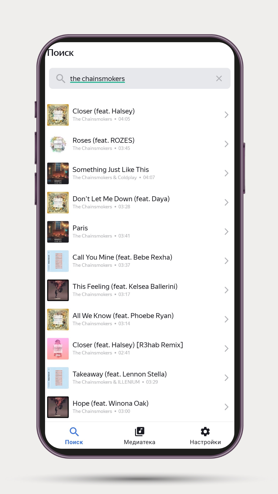
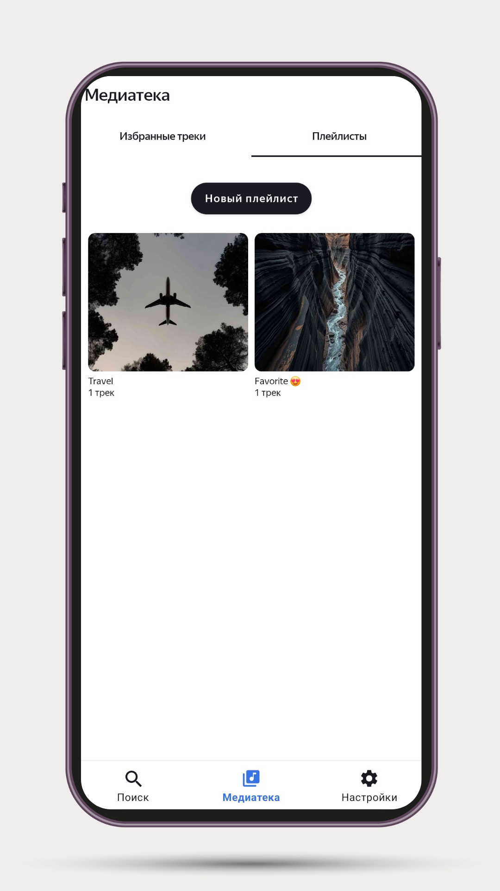
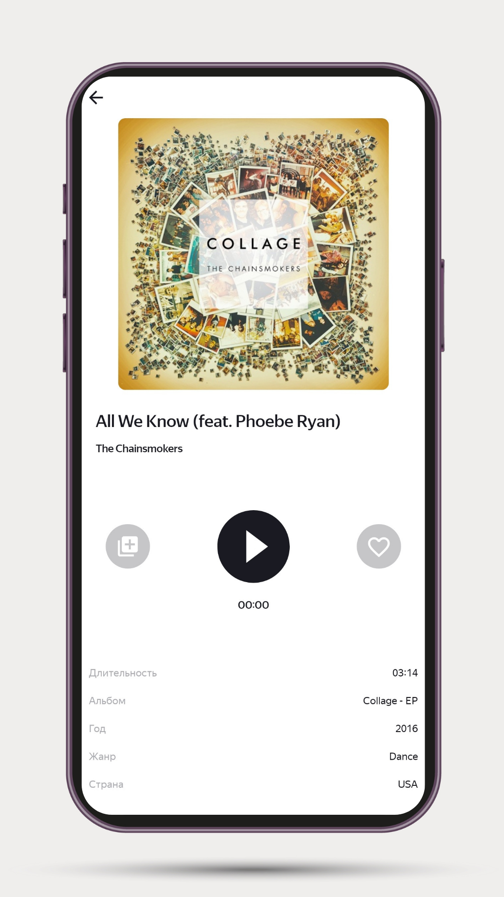
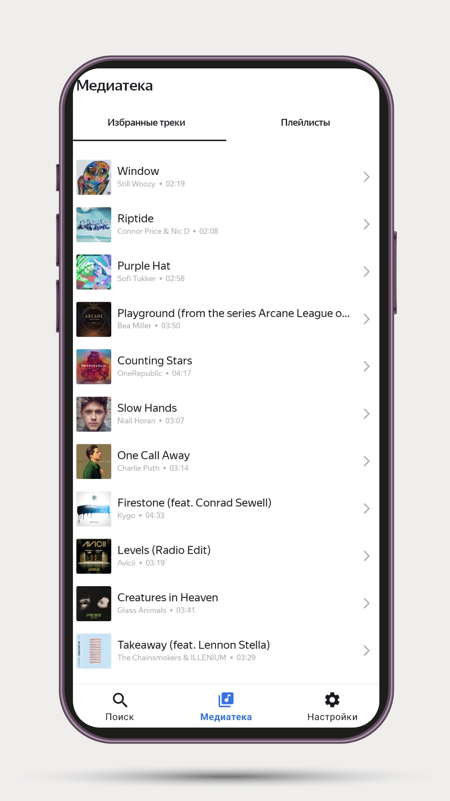
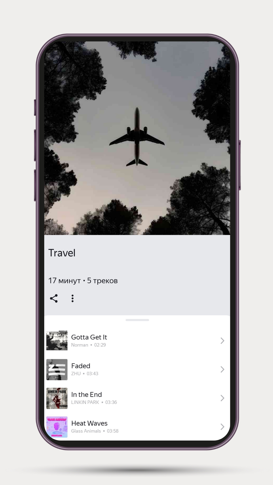
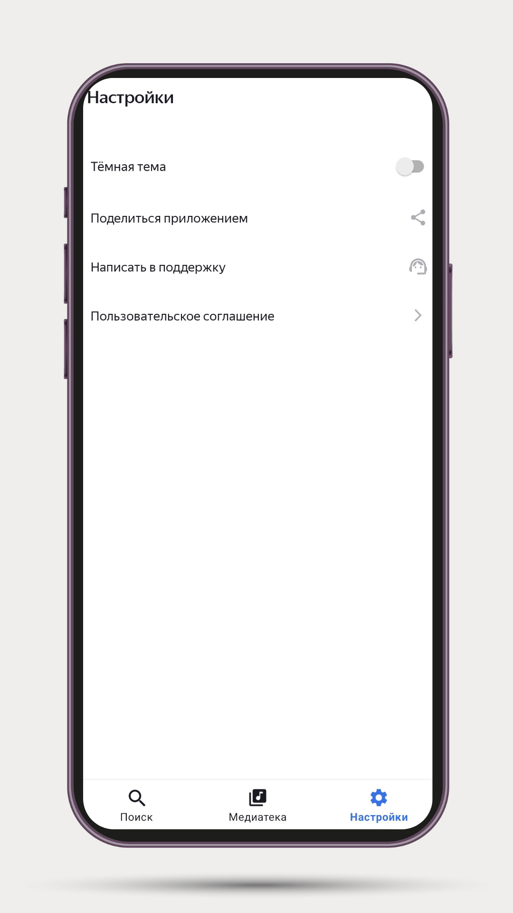

# ** Playlist Maker — учебный Android проект**  

**Playlist Maker** - приложение для поиска музыкальных треков с помощью публичного iTunes API, которое позволяет сохранять понравившиеся треки в "Избранное", создавать и редактировать плейлисты, а также прослушивать 30 секундное превью.
  
## 📱 Screenshots  

<p align="center">
    
    
    
</p>

<p align="center">
    
    
    
</p>
  
---  
  
## **Ключевые фичи**  

- Поиск треков через iTunes API с обработкой ошибок (нет интернета / пустой результат и т.д.).
- История поиска (последние 10 открытых треков).
- Экран плеера: информация о треке, проигрывание 30-секундного фрагмента, добавление в «Избранное» и в плейлист.
- «Избранное» хранится офлайн в базе Room.
- Плейлисты: создание, редактирование, удаление, добавление треков, проверка дубликатов.
- Нижняя панель навигации (Поиск / Медиатека / Настройки).
- Тёмная/светлая тема, переключаемая в настройках (SharedPreferences).
- Отправка плейлиста (share intent), отправка письма в поддержку (intent).
---  
## **🛠️ Технологический стек**  

- Язык: **Kotlin**
- Архитектура: **MVVM**, **Clean Architecture**
- Асинхронность: **Coroutines**
- Сеть: **Retrofit2**, **Gson**
- База данных:**Room**
- DI: **Koin**
- Navigation:**Jetpack Navigation Component** (safeArgs)
- UI:**Material**, **ViewPager2**, **TabLayout**, **ConstraintLayout**
- Медиа: стандартный`MediaPlayer`
- Библиотеки: Glide, AndroidX, LiveData, ViewModel и др.

---  
## Запуск проекта

### Требования

- Android Studio
- Android SDK (minSdk = 29)
- Интернет (для работы iTunes API)

### Установка

1. Клонировать репозиторий:
```  
git clone https://github.com/sandpaper-hub/PlaylistMaker.git  
```  
2.  Открыть проект в Android Studio
3. Дождаться сихнхронизации Gradle
4. Запустить на эмуляторе или физическом устройстве.